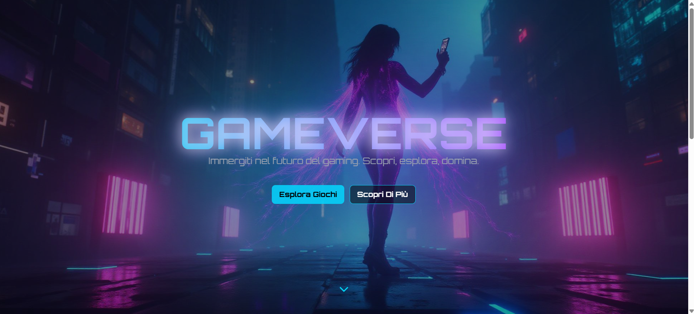
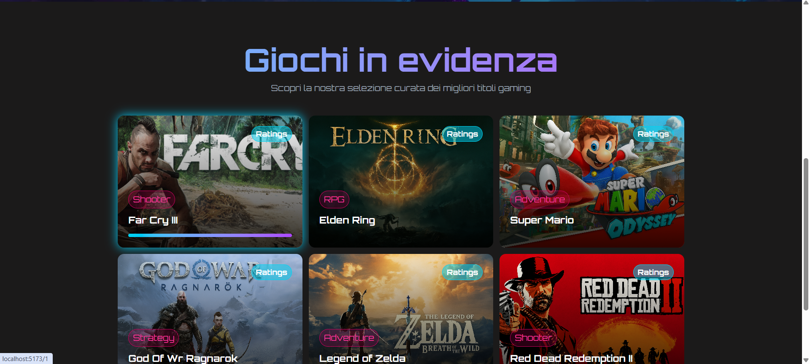
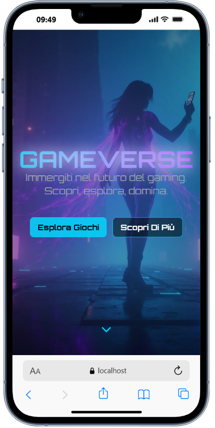
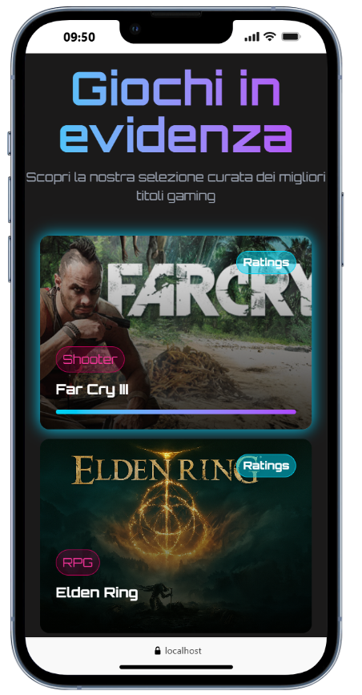
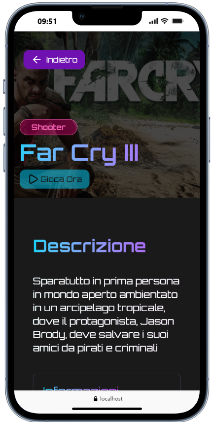
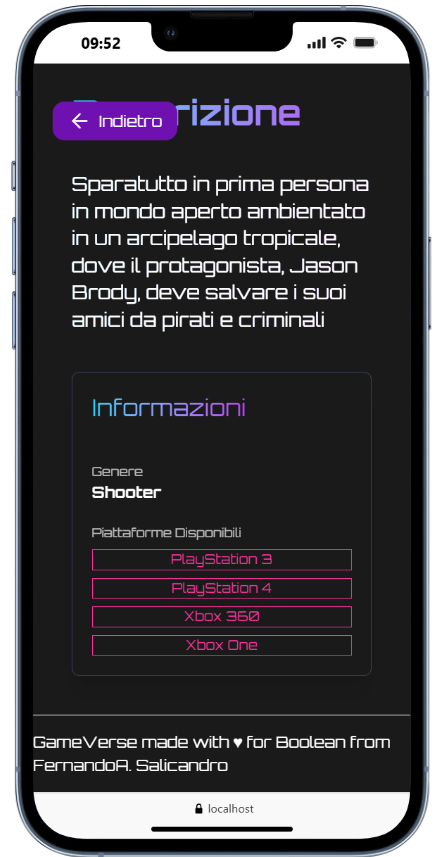

**GAMEVERSE** store fittizio per testing dell'API REST della repository final-laravel;

## 📸 Preview

### Desktop

### Mobile

  
  

  
  

##  Caratteristiche Principali

###  Design & UX
- **Hero Section animata** con effetto parallasse e glow effects
- **Design cyberpunk futuristico**
- **Animazioni fluide** con Framer Motion
- **Responsive design** ottimizzato per mobile, tablet e desktop
- **Font personalizzato** Orbitron

###  Funzionalità Core
-  **Catalogo Giochi** - Griglia responsive con card interattive
-  **Dettagli Giochi** - Pagina dedicata con descrizione, genere e piattaforme
-  **Gestione Immagini** - Integrazione con storage backend Laravel
-  **Smooth Scrolling** - Navigazione fluida con scroll to section
-  **Auto Scroll Top** - Reset automatico posizione scroll al cambio pagina

###  Stack Tecnologico

#### Frontend
- **TailwindCSS v4.1**
- **Framer Motion**
- **Axios** - per  richieste API REST
- **Lucide React** - per le icone

#### Architettura
- **Custom Hooks** - useGamesFetch, useDetailsFetch, useScrollY
- **RESTful API** - Comunicazione con backend Laravel

*Progetto Full-Stack: Frontend (React) + Backend (Laravel - https://github.com/FernandoSalicandro/final-laravel)*
